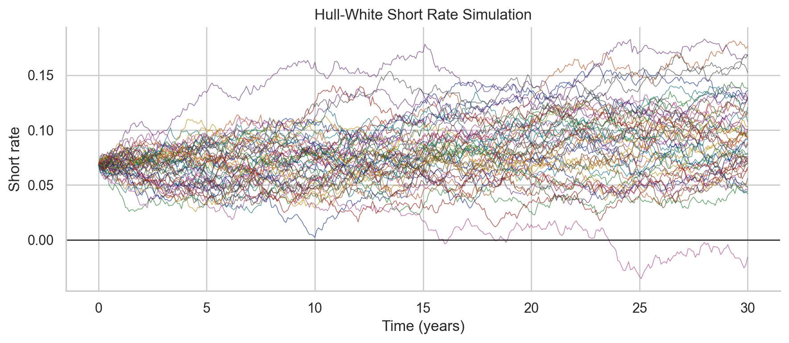
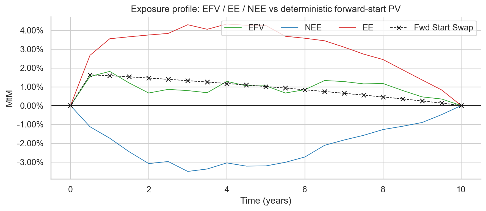

# Simulating-Interest-Rate-Swap-Exposure
# Objectives:

This project implements a Monte Carlo exposure simulation for a forward-starting interest rate swap under the Hull–White one-factor short-rate model, using QuantLib and Python.

The workflow consists of:
- Constructing a flat yield curve and calibrating a Hull–White short-rate process
- Simulating short-rate paths via Gaussian Monte Carlo:
  

  
- Valuing a payer interest rate swap dynamically along each simulated path:
- Computing dirty mark-to-market values between coupon dates (including accrued interest)
- Aggregating pathwise results into standard counterparty credit risk exposure metrics:
    - Expected Future Value (EFV)
    - Expected Exposure (EE)
    - Negative Expected Exposure (NEE)
 

- Comparing stochastic exposure profiles against the deterministic forward-start swap valuation implied by today’s curve
The project demonstrates a model-consistent exposure framework suitable for applications such as:
- Counterparty Credit Risk (CCR)
- CVA / FVA analytics
- IFRS 13 fair valuation
- Regulatory risk modeling and validation

The implementation emphasizes:
- Analytical Hull–White zero-coupon bond pricing
- Accurate accrual handling (“dirty” valuation)
- Clear separation between simulation, valuation, and exposure aggregation 
